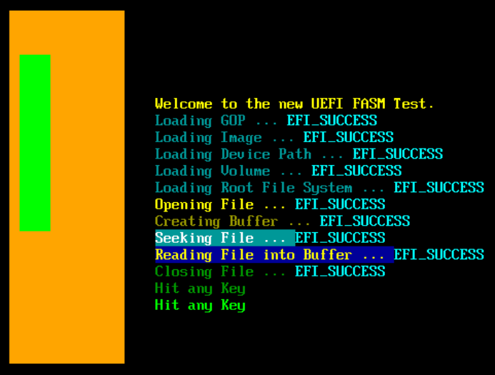

# UEFI in Flat Assembly - FASM

This code shows how to assemble the UEFI BOOTX64.EFI file in Assembly Code using FASM.

## Tool Needed

FASM  
https://flatassembler.net/  

VirtualBox  
https://www.virtualbox.org/  

Notepad++  
https://notepad-plus-plus.org/  

UEFI Specs PDF  
https://uefi.org/specifications  

OSFMount  
https://www.osforensics.com/tools/mount-disk-images.html  

NOTE :  
This is an unfinished project. I put this here for others to continue my work if they wish.

NOTE 2 : I originally used the UEFI 2.8b PDF specs for this project, but should be 100% compatible with the UEFI 2.9 PDF specs.  

NOTE 3 : I included the imagecreator so you can create the 256 meg raw drive.hdd file to be mounted with OSFMount, GPT / EFI partitioned with the use of windows partition program ( comes with windows ) and then you can drag your EFI file to EFI/Boot/ folder. ( You have to create those folders. )  VirtualBox is compatible with HDD files. Just mount it like a hard drive. QEMU also works with HDD files.  

# PROGRESS:
    - [x] TEXT  
    - [x] COLOR  
    - [x] KEYBOARD  
    - [x] ERROR CHECKING  
    - [x] GOP  
    - [x] COMPUTER REBOOT - COLD, WARM, SHUTDOWN  
    - [x] FILE SYSTEM LOADING  
    - [x] OPEN FILE HANDLE  
    - [x] CLOSE FILE HANDLE  
    - [x] ALLOCATEPOOL AND READ FILE INTO BUFFER  

# Planned, but never finished:  
    - [ ] GRAPHIC TEXT  
    - [ ] MEMORY MANAGEMENT  
    - [ ] KERNEL LOADING  
    - [ ] BONUS - Mouse Support - ( USB 1.1 and USB 2.0 using the PS/2 Protocol ) 
          

